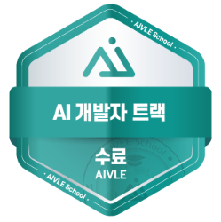
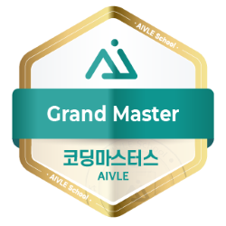
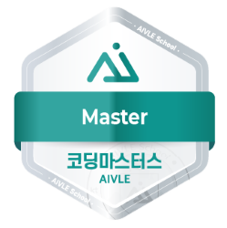
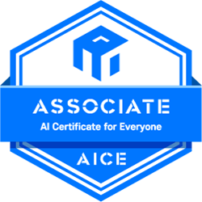

# About Me

데이터 분석 연구원으로서의 경험, 인공지능 석사 과정, 그리고 KT AIVLE School에서의 여정을 통해 다양한 데이터 분석 기술과 인공지능 모델 연구 역량을 키워왔습니다. 이를 바탕으로 끊임없이 도전하며 성장해 나가고 있습니다.

저는 AI 기술이 사람들의 일상에 편리함을 더하고, 실질적인 변화를 일으켜 사회에 긍정적인 영향을 미칠 수 있다고 믿습니다. 이러한 믿음을 바탕으로 새로운 기술을 배우고, 사람들에게 도움이 되는 솔루션을 제공하며, 사회 발전에 기여할 수 있는 인재가 되고자 합니다.

# My Journey

- **KT AIVLE School 5기 AI 개발자 과정 수료**

    

        
        
        
    

    > - 2024.02 - 2024.08
    > - **성적 우수상 수상 (1st)**, **프로젝트 우수상 수상 (3rd)**

- **단국대학교 인공지능융학학 석사과정 졸업**

    > - 2022.03 - 2024.08
    > - 학위논문: 강건한 혼합 효과 신경망을 이용한 시선 추정
    (Gaze Estimation with Robust Mixed Effect Neural Network)

- **BRFrame 데이터 분석 연구원**

    > - 2020.06 - 2023.02 (2년 8개월)
    > - 데이터 처리 및 분석, 인공지능 모델 개발 및 배포, Azure Cloud Service

- **한양대학교 산학협력단 머신러닝을 이용한 빅데이터 전문가 양성과정 수료**

    > - 2019.12 - 2020.06

- **대진대학교 전자공학과 공학사 졸업**

    > - 2014.03 - 2020.02

# Certification

    
    

- **AICE ASSOCIATE**

    > - 2024.07.12 - 2027.07.11

- **Microsoft Certified: Azure Administrator Associate (AZ-104)**

    > - 2020.11.29 - 2025.11.28
